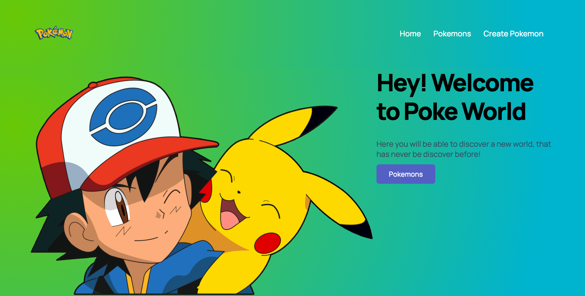
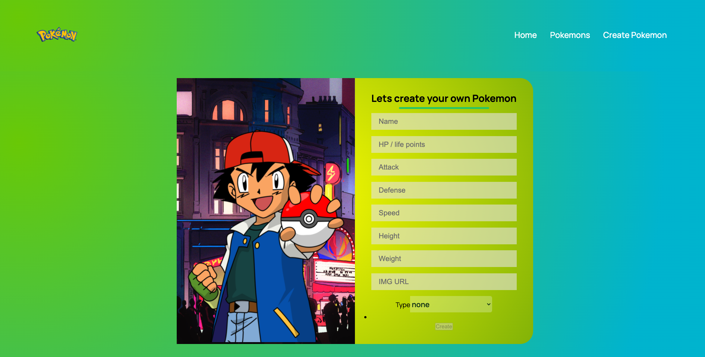
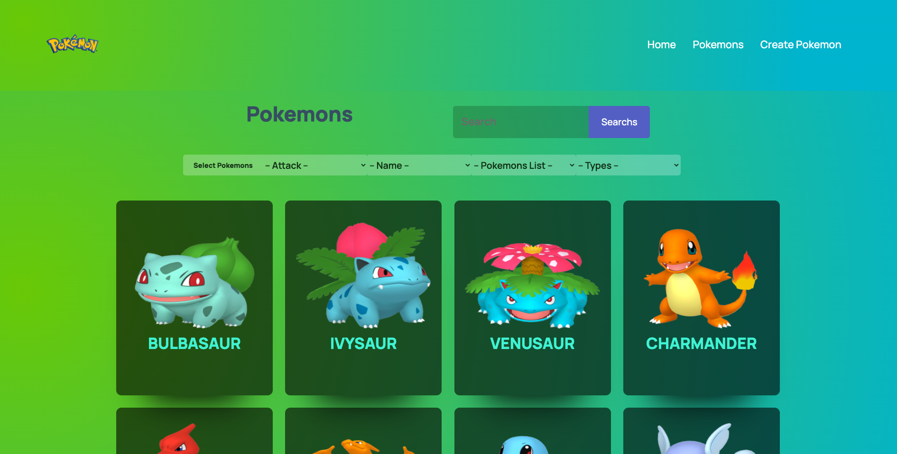

# Individual Project - Henry Pokemon

  

## The project was build with:

- React, Redux, Node JS, Express y Sequelize.

---

# To run this proyect
You must be into the:
- /client
- /api
 
then you will need to run [NPM start] into the both directories

<h3> You can check a preview here </h3>

HOME

CREATE POKEMON

LIST OF POKEMONS

---

    

⭐️ From [@Davidcastel26](https://github.com/Davidcastel26)
